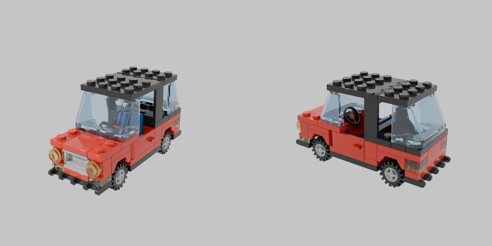

<div align="center">

# ldraw-mcp

**Give your MCP client eyes for LEGO® models.**

Render LDraw files (`.ldr` / `.mpd` / `.dat`) to images with _real part
geometry_ — studs, slopes, window glass — using headless Blender and the
ImportLDraw addon. The output looks like a BrickLink Stud.io render, with no
GUI anywhere in the loop.

[](https://pypi.org/project/ldraw-mcp/)
[](https://pypi.org/project/ldraw-mcp/)
[](LICENSE)
[](https://modelcontextprotocol.io)
[](https://github.com/musharna/ldraw-mcp/actions/workflows/ci.yml)
[](https://glama.ai/mcp/servers/musharna/ldraw-mcp)
[](https://doi.org/10.5281/zenodo.21713452)



<sub>A ~90-line <code>.ldr</code> rendered front-left and rear-right — actual bricks, not a geometric proxy.</sub>

</div>

<!-- mcp-name: io.github.musharna/ldraw-mcp -->

---

Point a vision-capable model at a build and it sees the actual bricks:
crossed rotation matrices, floating plates, sunken windows — the kinds of
export bugs a geometric proxy render will happily hide.

## Quickstart

```bash
# 1. install
pip install ldraw-mcp

# 2. install the LDraw parts library + ImportLDraw addon
ldraw-mcp-setup

# 3. register with Claude Code
claude mcp add ldraw -- ldraw-mcp
```

Then ask things like _"render output/build.ldr and tell me what looks
wrong"_ — the model sees the render, not just the text.

> **Blender is a prerequisite** (see [Requirements](#requirements)); it is
> not installed by `ldraw-mcp-setup`.

## Tools

| tool                                                                      | what it does                                                     |
| ------------------------------------------------------------------------- | ---------------------------------------------------------------- |
| `render_ldraw_file(path, azimuths="-60,120", resolution=640, samples=24)` | Render a model file to a PNG (multi-view, stitched side by side) |
| `render_ldraw_text(ldr, azimuths="-60,120", resolution=640, samples=24)`  | Render inline LDraw content without writing a file first         |
| `check_renderer()`                                                        | Diagnose the Blender / addon / parts-library setup               |

`azimuths` is a comma-separated list of view angles in degrees; each is
rendered and the views are stitched horizontally. Elevation is fixed at
22°. Higher `samples` = cleaner but slower.

## Requirements

- **Blender 4.x** on `PATH`, or point `LDRAW_MCP_BLENDER` at the binary.
  Install it yourself (package manager, blender.org, or a local build);
  `ldraw-mcp-setup` does not install Blender.
- **ImportLDraw addon** (`io_scene_importldraw`) in Blender's addons dir —
  installed by `ldraw-mcp-setup`.
- **LDraw parts library** at `~/.ldraw` (or `LDRAW_LIBRARY_PATH`) —
  installed by `ldraw-mcp-setup`.

### Environment variables

| var                  | meaning                                                |
| -------------------- | ------------------------------------------------------ |
| `LDRAW_MCP_BLENDER`  | Path to the blender binary (overrides `PATH` lookup)   |
| `LDRAW_MCP_DISABLE`  | Set to `1` to force `is_available()` to `False`        |
| `LDRAW_LIBRARY_PATH` | Path to the LDraw parts library (community convention) |

### Manual setup

If `ldraw-mcp-setup` can't detect things automatically:

- **LDraw library:** download
  [complete.zip](https://library.ldraw.org/library/updates/complete.zip)
  and unzip so that `~/.ldraw/parts/` exists.
- **ImportLDraw addon:** download the latest release from
  [TobyLobster/ImportLDraw](https://github.com/TobyLobster/ImportLDraw/releases)
  and install it via _Blender > Preferences > Add-ons > Install_, or unzip
  into `~/.config/blender/<version>/scripts/addons/io_scene_importldraw/`.
  (Launch Blender once first so the config directory exists.)

## Troubleshooting

- **`check_renderer` says NOT FOUND:** run `ldraw-mcp-setup`, or set the
  relevant env var above.
- **No GPU / WSL2 / containers:** rendering uses **Cycles on CPU**, which
  works headless everywhere — no GPU or display needed. A ~150-part model
  takes a few seconds at the default 640px / 24 samples.
- **"no mesh objects imported":** the addon couldn't resolve parts —
  usually a wrong or incomplete LDraw library path. Re-run setup or check
  `LDRAW_LIBRARY_PATH`.
- **Addon not enabled:** the render script enables it automatically per
  run; if a manual Blender session complains, enable `io_scene_importldraw`
  in Preferences > Add-ons.

## Provenance

This renderer was extracted from the **prompt2brick** project, where it
started life as the vision critic's "see the actual model" path.
prompt2brick keeps its own vendored copy of the render wrapper and Blender
script, but **this repo is the canonical source going forward** — fixes and
improvements to the renderer should land here first and be ported back into
prompt2brick.

## License

MIT — see [LICENSE](LICENSE).

---

<sub>LEGO® is a trademark of the LEGO Group, which does not sponsor,
authorize, or endorse this project. This tool is not affiliated with the
LEGO Group, BrickLink, or the LDraw.org organization.</sub>
